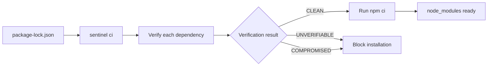

# sentinel-npm

> Repository for the Sentinel npm ecosystem. Published CLI: `sentinel`. npm wrapper for `npx`: `sentinel-check`.


Package managers install fast. **sentinel** adds a trust gate before that: it verifies the lockfile, registry metadata, and tarball integrity — and only allows installation when the whole chain checks out.

This repository has two entry points:

- `sentinel`: the main CLI binary
- `sentinel-check`: the npm wrapper for use with `npx` and automation

---

## What you get

| Capability | npm / yarn / pnpm | sentinel |
| --- | --- | --- |
| Install dependencies | ✅ | ✅ |
| Audit lockfile without installing | ❌ | ✅ |
| Validate tarball integrity | ❌ | ✅ |
| Validate lockfile against registry | ❌ | ✅ |
| Block a compromised package | ❌ | ✅ |
| Security gate for CI | ❌ | ✅ |
| Machine-readable output | ❌ | ✅ |

---

## Pick the right command

| Command | When to use | What it does |
| --- | --- | --- |
| `sentinel check` | Local audit, PR review, debugging | Audits the current project without installing anything |
| `sentinel ci` | Pipeline, clean environment, strict gate | Verifies **every package in the lockfile** and, if all pass, runs `npm ci` |
| `sentinel install package@version` | Adding a new package safely | Resolves the package in the lockfile, verifies the target and its transitive deps, then runs `npm install` |
| `sentinel report package` | Manually report a suspicious package | Prints the evidence escalation flow for the given package |

> If your goal is "install the whole project from the lockfile", the right command is `sentinel ci`.

---

## How the flow works



If the project does not yet have a `package-lock.json`, Sentinel will attempt to generate one before verifying.

---

## Get started in 30 seconds

### Option A: no installation needed

Good for quick evaluation, ephemeral environments, and CI.

```bash
# verify the whole project and, if clean, run npm ci
npx -y -p sentinel-check ci

# audit the project without installing anything
npx -y -p sentinel-check check

# install a specific package with verification
npx -y -p sentinel-check install express@4.21.2
```

### Option B: binary on PATH

Good for teams that will use Sentinel daily.

#### Linux and macOS

Standard install to `/usr/local/bin`:

```bash
curl -fsSL https://raw.githubusercontent.com/SIG-sentinel/sentinel-npm/main/scripts/install.sh | sudo sh
```

Install to user directory:

```bash
curl -fsSL -o /tmp/install-sentinel.sh https://raw.githubusercontent.com/SIG-sentinel/sentinel-npm/main/scripts/install.sh
INSTALL_DIR="$HOME/.local/bin" sh /tmp/install-sentinel.sh
```

Pin a specific version:

```bash
curl -fsSL -o /tmp/install-sentinel.sh https://raw.githubusercontent.com/SIG-sentinel/sentinel-npm/main/scripts/install.sh
sh /tmp/install-sentinel.sh --version 0.1.0
```

Confirm installation:

```bash
sentinel --version
```

#### Windows

The supported path today is a manual binary download from [github.com/SIG-sentinel/sentinel-npm/releases](https://github.com/SIG-sentinel/sentinel-npm/releases), followed by checksum verification using `checksums.txt`.

---

## Real usage examples

### 1. Audit without installing

```bash
sentinel check
```

### 2. Verify the full lockfile and then install

```bash
sentinel ci
```

### 3. Dry-run verification without touching `node_modules`

```bash
sentinel ci --dry-run
```

### 4. Skip dev dependencies in the pipeline

```bash
sentinel ci --omit-dev
```

### 5. Install an exact package with verification

```bash
sentinel install lodash@4.17.21
```

> `sentinel install` requires an exact version. Tags like `latest` and ranges like `^4.0.0` are not accepted.

---

## Add to package.json

### Using npx

```json
{
  "scripts": {
    "sentinel:ci": "npx -y -p sentinel-check ci",
    "sentinel:check": "npx -y -p sentinel-check check",
    "sentinel:install": "npx -y -p sentinel-check install"
  }
}
```

### Using the binary on PATH

```json
{
  "scripts": {
    "sentinel:ci": "sentinel ci",
    "sentinel:check": "sentinel check",
    "sentinel:install": "sentinel install"
  }
}
```

Usage:

```bash
npm run sentinel:ci
npm run sentinel:check
npm run sentinel:install -- express@4.21.2
```
### Using npx

```json
{
  "scripts": {
    "sentinel:ci": "npx -y -p sentinel-check ci",
    "sentinel:check": "npx -y -p sentinel-check check"
  }
}
```

To install a specific package with verification, pass the argument directly:

```bash
npx -y -p sentinel-check install express@4.21.2
```

### Using the binary on PATH

```json
{
  "scripts": {
    "sentinel:ci": "sentinel ci",
    "sentinel:check": "sentinel check"
  }
}
```

Usage:

```bash
npm run sentinel:ci
npm run sentinel:check
sentinel install express@4.21.2
```
---

## CI/CD integration

### GitHub Actions with npx

```yaml
- name: Verify dependency integrity
  run: npx -y -p sentinel-check ci
```

### GitHub Actions with installed binary

```yaml
- name: Install sentinel
  run: curl -fsSL https://raw.githubusercontent.com/SIG-sentinel/sentinel-npm/main/scripts/install.sh | sudo sh

- name: Verify dependency integrity
  run: sentinel ci
```

### Machine-readable output

```bash
sentinel check --format json
sentinel check --format junit
sentinel check --format github
sentinel ci --dry-run --format json --report sentinel-report.json
```

---

## How to interpret results

| Status | Meaning | Effect |
| --- | --- | --- |
| `CLEAN` | integrity confirmed | installation allowed |
| `UNVERIFIABLE` | could not confirm the chain | installation blocked |
| `COMPROMISED` | divergence detected | installation blocked |

---

## Main components

```text
sentinel-npm/
├── src/commands/          check, install, ci, and report commands
├── src/verifier/          lockfile and tarball verification
├── src/npm/               package-lock, package.json, and registry integration
├── src/policy/            blocking rules and script execution policy
├── src/ui/                terminal output and report formats
├── src/types/             domain-typed contracts
├── src/constants/         messages and configuration
├── src/crypto.rs          hashing and integrity validation
├── src/cache.rs           local verification cache
└── packages/sentinel-check/ npm wrapper for npx and Node environments
```

---

## Status


