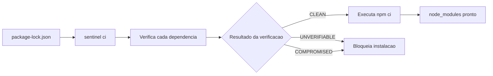

# sentinel-npm

> Repositorio do Sentinel para ecossistema npm. CLI publicada: `sentinel`. Wrapper npm para `npx`: `sentinel-check`.


Gerenciadores de pacote instalam rapido. O **sentinel** adiciona uma etapa de confianca antes disso: verifica lockfile, registry e tarball e so permite a instalacao quando a cadeia bate.

Neste repositorio existem dois pontos de entrada:

- `sentinel`: o binario/CLI principal
- `sentinel-check`: o wrapper npm para uso com `npx` e automacao

---

## O que voce ganha

| Capacidade | npm / yarn / pnpm | sentinel |
| --- | --- | --- |
| Instalar dependencias | ✅ | ✅ |
| Auditar lockfile sem instalar | ❌ | ✅ |
| Validar integridade do tarball | ❌ | ✅ |
| Validar lockfile contra registry | ❌ | ✅ |
| Bloquear pacote comprometido | ❌ | ✅ |
| Gate de seguranca para CI | ❌ | ✅ |
| Saida para automacao | ❌ | ✅ |

---

## Escolha o comando certo

| Comando | Quando usar | O que ele faz |
| --- | --- | --- |
| `sentinel check` | Auditoria local, PR review, debugging | Verifica o projeto atual sem instalar nada |
| `sentinel ci` | Pipeline, ambiente limpo, gate estrito | Verifica **todos os pacotes do lockfile** e, se tudo estiver limpo, executa `npm ci` |
| `sentinel install pacote@versao` | Adicionar um pacote novo com seguranca | Resolve o pacote no lockfile, verifica o alvo e as transitivas, depois executa `npm install` |
| `sentinel report pacote` | Reportar suspeita manualmente | Exibe o fluxo de encaminhamento de evidencia para pacote suspeito |

> Se a sua pergunta for "quero instalar o projeto inteiro com base no lockfile", o comando certo e `sentinel ci`.

---

## Como o fluxo funciona



Se o projeto ainda nao tiver `package-lock.json`, o Sentinel tenta gera-lo antes de verificar.

---

## Comece em 30 segundos

### Opcao A: sem instalar nada

Boa para avaliacao rapida, ambientes efemeros e CI.

```bash
# verifica o projeto inteiro e, se estiver limpo, executa npm ci
npx -y -p sentinel-check ci

# audita o projeto sem instalar nada
npx -y -p sentinel-check check

# instala um pacote especifico com verificacao
npx -y -p sentinel-check install express@4.21.2
```

### Opcao B: binario no PATH

Boa para equipes que vao usar Sentinel diariamente.

#### Linux e macOS

Instalacao padrao em `/usr/local/bin`:

```bash
curl -fsSL https://raw.githubusercontent.com/SIG-sentinel/sentinel-npm/main/scripts/install.sh | sudo sh
```

Instalacao no diretorio do usuario:

```bash
curl -fsSL -o /tmp/install-sentinel.sh https://raw.githubusercontent.com/SIG-sentinel/sentinel-npm/main/scripts/install.sh
INSTALL_DIR="$HOME/.local/bin" sh /tmp/install-sentinel.sh
```

Fixando uma versao especifica:

```bash
curl -fsSL -o /tmp/install-sentinel.sh https://raw.githubusercontent.com/SIG-sentinel/sentinel-npm/main/scripts/install.sh
sh /tmp/install-sentinel.sh --version 0.1.0
```

Confirmacao:

```bash
sentinel --version
```

#### Windows

Hoje o caminho suportado e download manual do binario em [github.com/SIG-sentinel/sentinel-npm/releases](https://github.com/SIG-sentinel/sentinel-npm/releases), seguido de verificacao com `checksums.txt`.

---

## Exemplos de uso real

### 1. Auditar sem instalar

```bash
sentinel check
```

### 2. Verificar o lockfile inteiro e depois instalar

```bash
sentinel ci
```

### 3. Verificar sem tocar em `node_modules`

```bash
sentinel ci --dry-run
```

### 4. Ignorar dependencias de desenvolvimento no pipeline

```bash
sentinel ci --omit-dev
```

### 5. Instalar um pacote exato com verificacao

```bash
sentinel install lodash@4.17.21
```

> `sentinel install` exige versao exata. Tags como `latest` e ranges como `^4.0.0` nao sao aceitos.

---

## Adote no package.json

### Usando npx

```json
{
  "scripts": {
    "sentinel:ci": "npx -y -p sentinel-check ci",
    "sentinel:check": "npx -y -p sentinel-check check",
    "sentinel:install": "npx -y -p sentinel-check install"
  }
}
```

### Usando binario no PATH

```json
{
  "scripts": {
    "sentinel:ci": "sentinel ci",
    "sentinel:check": "sentinel check",
    "sentinel:install": "sentinel install"
  }
}
```

Uso:

```bash
npm run sentinel:ci
npm run sentinel:check
npm run sentinel:install -- express@4.21.2
```

---

## Integracao em CI/CD

### GitHub Actions com npx

```yaml
- name: Verificar integridade de dependencias
  run: npx -y -p sentinel-check ci
```

### GitHub Actions com binario instalado

```yaml
- name: Instalar sentinel
  run: curl -fsSL https://raw.githubusercontent.com/SIG-sentinel/sentinel-npm/main/scripts/install.sh | sudo sh

- name: Verificar integridade de dependencias
  run: sentinel ci
```

### Saida para automacao

```bash
sentinel check --format json
sentinel check --format junit
sentinel check --format github
sentinel ci --dry-run --format json --report sentinel-report.json
```

---

## Como interpretar os resultados

| Status | Significado | Efeito |
| --- | --- | --- |
| `CLEAN` | integridade confirmada | instalacao permitida |
| `UNVERIFIABLE` | nao foi possivel confirmar a cadeia | instalacao bloqueada |
| `COMPROMISED` | divergencia detectada | instalacao bloqueada |

---

## Componentes principais

```text
sentinel-npm/
├── src/commands/          comandos check, install, ci e report
├── src/verifier/          verificacao de lockfile e tarball
├── src/npm/               integracao com package-lock, package.json e registry
├── src/policy/            regras de bloqueio e decisao de scripts
├── src/ui/                saidas de terminal e formatos de relatorio
├── src/types/             contratos tipados por dominio
├── src/constants/         mensagens e configuracoes
├── src/crypto.rs          hashing e validacao de integridade
├── src/cache.rs           cache local de verificacao
└── packages/sentinel-check/ wrapper npm para npx e ambientes Node
```

---

## Status


